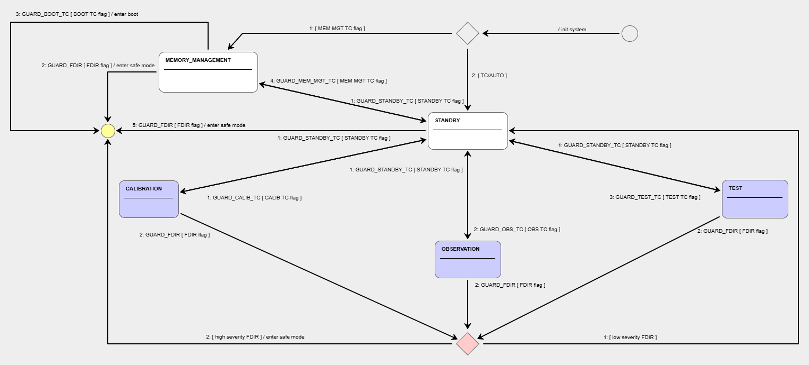

| :memo:        | The purpose of this repository is to give interviewees for the position of low level embedded software developer at DTU Space, the opportunity to prove their technical documentation and development skills by taking this repository and adding some design documentation text and images to this README.md file, as well as some code. All the steps to follow and homework instructions are presented in this readme |
|---------------|:------------------------|

# What is this?

This repository contains a working example of a typical DTU Space application software development project. It is ment to be used visual [Visual Studio Code (VS Code)](https://code.visualstudio.com/) and an ubunto linux machine. The project contains:

- Compilable source code for PC and GR740
- A makefile structure to build the project and its libraries for two different compilation targets (PC and GR740)

| :point_up:    | This exercise will focus only on the PC compilable source code |
|---------------|:------------------------|

- VSCode configuration that allows the project to be built and de-bugged from VSCode
- A [Dev Container](https://code.visualstudio.com/docs/devcontainers/create-dev-container) configuration that builds a [Docker container](https://docker.com/resources/what-container/) that contains and sets up all the dependencies needed two compile for both deployment targets.

# How to use this?

There are some prerequisites that need to be fulfilled for using the example project:

- A Linux machine (preferable with a Debian/Ubuntu based OS) that has:
    - Docker installed and configured on the system (see instructions [here](https://docs.docker.com/engine/install/ubuntu/))
    - Your current user is in the *docker* group (see instructions [here](https://docs.docker.com/engine/install/linux-postinstall/))
    - git installed
    - The environment variables USER_ID and GROUP_ID must be defined:
        - Add the following to your profile `.bashrc`, `.zshrc`, etc.:
            ```sh
            export USER_ID=$(id -u)
            export GROUP_ID=$(id -g)
            ```
        - You can then make the changes take place by executing the .bashrc in the bash terminal:
            ```sh
            source ~/.bashrc
            ```
            Or by rebooting the machine.

There are two ways the system can be used:

1. Running VS Code directly on the Linux machine (Use case 1)
2. Running VS Code on a Windows machine and using the [Remote development](https://code.visualstudio.com/docs/remote/ssh) feature of VS Code for actually working on the Linux machine (Use case 2)

# VSCode configuration

Regardless of whether use case 1 or 2 is used, the VS Code needs to have the following extensions [installed](https://code.visualstudio.com/docs/editor/extension-marketplace):

- Dev Containers
- Remote Development

Furthermore, in case use case 2 is used, a SSH key pair authentication should be set up between the Windows and the Linux machines as described [here](docs/ssh_authentication_between_windows_and_linux.md).

# Copy this repository onto your physical/virtual Linux machine and create a new github repository from it

For working with the repository it must be firts cloned/downloaded to your linux instance and then a new github repository needs to be created from the files you copied. It should initially look the same as the provided one.

| :exclamation:  DO NOT FORK THE REPOSITORY.|
|-----------------------------------------|

# Dev Container configuration

The dev container is configured in the `.devcontainer/devcontainer.json` file, the configuration is documented in the comments within the file. The docker container itself is built from the `.devcontainer/Dockerfile`. The dockerfile format is documented [here](https://docs.docker.com/reference/dockerfile/). A summary of how the docker container is built is as follows:

1. The container is based on the latest version of Ubuntu.
2. The desired versions of BCC and MKPROM2 are specified - this is done by declaring the environment variables `BCC_VERSION` and `MKPROM2_VERSION`. **NOTE:** In case BCC version >= 2.3.0 is desired the line starting with `ENV BCC_PREFIX` must be uncommented.

| :point_up:    | The BCC dependecy can be ignored for the PC version which we are going to compile |
|---------------|:------------------------|

3. The necessary dependencies are downloaded and installed.

# Running the code

In order to run the code:

For use case 1:

   - Open the cloned git repository folder in VS Code.

For use case 2:

   - Open the command palette (`Ctrl+Shift+P`).
   - Type and select `Remote-SSH: Connect to Host...`.
   - Choose the host you configured, see [here](docs/ssh_authentication_between_windows_and_linux.md).
   - Once connected to the remote host, you can open a folder on the remote machine by selecting `File -> Open Folder` and navigating to the desired directory, which is the directory into which you have cloned the git repository.

The rest of the steps are the same for both use cases:

   - Open the command palette (`Ctrl+Shift+P`).
   - Type and select `Dev Containers: Reopen in Container`
   - VS Code will now build the container and re-open the folder within the container once ready
   - Open the `Run and Debug` sidebar (`Ctrl+Shift+D`)
   - Choose the debug option for the PC version.
   - Press the green arrow or F5 to start debugging the project. This will:
        - Automatically invoke the makefile to build the project with gcc
        - Attach to it over GDB
        - Start the execution and break at the beginning of the `main` function
   - You can now, single step through the code, set breakpoints, monitor variables and registers using the watch function, monitor the call stack etc.

# What can this code do?

Currently this code does two things:

- Runs a debug terminal application that allows the user to interface with the code by use of commands that run test functions within the code.
- Creates, initializes and runs a space qualified state machine modelled after the typical operational modes of science processing application software for satellites.

# How to use the debug terminal

The debug terminal works similarly to a linux terminal, you can use "ls" to list the contents of the file system the terminal exposes. The terminal is organised into folders and within this folders there can be other folders or test functions. An example of how to run the hellow world command can be seen below:

```
DTU Space - AIB EGSE custom simulator
Debug interface - Copyright(c) DTU Space 2020
/>ls
        app             Application layer tests
/>app
/app>ls
        /               Root directory
        ..              Parent directory
        hello_world             Prints Hello World
        hist_dump               Prints the contents of the terminal history
/app>hello_world 1
Hello world 1!
/app>
```

# The homework

Once you have forked the repository and gotten everything to work as described **we want the following sections of the readme to be completed with design details you can derive from studying the code and the environments structure.**

# BLOCK DIAGRAM OF THE CODE DEPENDENCIES

Provide a block diagram showing the dependency structure of the code base.

# UML SEQUENCE DIAGRAM OF THE CODE BASE

Provide a UML sequence diagram showing the flow of the code from the initialization routine to the iterative while (1) loop.

| :point_up:    | Maybe consider splitting it into two diagrams, one for initialization and one for the while loop |
|---------------|:------------------------|

See an example of a sequence diagram here:


# UML-like CLASS DIAGRAM OF THE board_architecture_t STRUCTURE

Provide a UML-like class diagram of the board_architecture_t structure and all its children structures.

# DESCRIPTION OF THE STATE MACHINE FLOW

Study the following operational state machine diagram and its associated code in "operational_sm.c" and provide a technical description of how the state transitions work.



# ADD DEBUG TERMINAL TELECOMANDS TO ENABLE STATE TRANSITIONS

Currently the state transition guards are returning hardcoded values instead of doing the checks they should be doing. We would like you to, using the state machine logic presented above and in the existing code, write some debug terminal functions that set flags for the state machine guards to check and enable or prevent transitions.

# Completing the homework

After having completed the homework, we would like you to send us a link to your modified repository so we can review the homework prior to the interview. **Deadline is one day before the interview.**