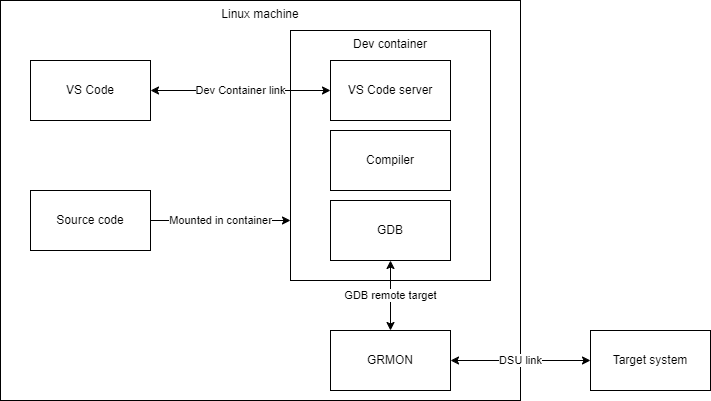
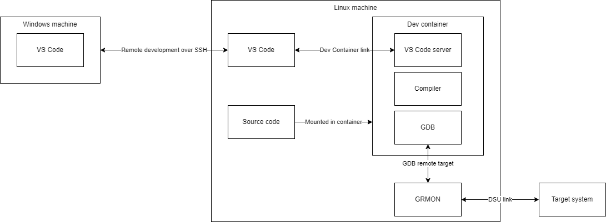

# What is this?

This repository contains a working example of a DTU Space project running the Theseus XGIS DHU operational state machine and configured to be used in [Visual Studio Code (VS Code)](https://code.visualstudio.com/) for the gr740 development board. The project contains:

- Compilable source code for a draft operational state machine of the Theseus XGIS DHU
  
- A makefile to build the project
- VSCode configuration that allows the project to be built and de-bugged from VSCode
- A [Dev Container](https://code.visualstudio.com/docs/devcontainers/create-dev-container) configuration that builds a [Docker container](https://docker.com/resources/what-container/) that contains and sets up the [BCC](https://gaisler.com/index.php/products/operating-systems/bcc) toolchain necessary for building the example project

# How to use this?

There are some prerequisites that need to be fulfilled for using the example project:

- A Linux machine (preferable with a Debian/Ubuntu based OS) that has:
    - GRMON installed, is in path, and properly configured with the license key
    - A physical connection DSU to the target system, in the case of the example a GR716A is used, so a UART connection is used
    - Docker is installed and configured on the system (see instructions [here](https://docs.docker.com/engine/install/ubuntu/))
    - Your current user is in the *docker* group (see instructions [here](https://docs.docker.com/engine/install/linux-postinstall/))
    - git is installed
    - The environment variables USER_ID and GROUP_ID must be defined:
        - Add the following to your profile `.bashrc`, `.zshrc`, etc.:
            ```sh
            export USER_ID=$(id -u)
            export GROUP_ID=$(id -g)
            ```
        - You can then make the changes take place by executing the .bashrc in the bash terminal:
            ```sh
            source ~/.bashrc
            ```
            Or by rebooting the machine.

There are two ways the system can be used:

1. Running VS Code directly on the Linux machine (Use case 1)
2. Running VS Code on a Windows machine and using the [Remote development](https://code.visualstudio.com/docs/remote/ssh) feature of VS Code for actuallt working on the Linux machine (Use case 2)

The two configurations are illustrated below:





# VSCode configuration

Regardless of whether use case 1 or 2 is used, the VS Code needs to have the following extensions [installed](https://code.visualstudio.com/docs/editor/extension-marketplace):

- Dev Containers
- Remote Development

Furthermore, in case use case 2 is used, a SSH key pair authentication should be set up between the Windows and the Linux machines as described [here](docs/ssh_authentication_between_windows_and_linux.md).

# Clone this repository onto the Linux machine

For working with the repository it must be cloned to the Linux machine:

```sh
git clone https://ElectronicsAndMechanics@dev.azure.com/ElectronicsAndMechanics/ELMECH%20Embedded%20Coding%20Standard/_git/VScode_example <PATH TO LOCATION ON YOUR MACHINE>
```

# Dev Container configuration

The dev container is configured in the `.devcontainer/devcontainer.json` file, the configuration is documented in the comments within the file. The docker container itself is built from the `.devcontainer/Dockerfile`. The dockerfile format is documented [here](https://docs.docker.com/reference/dockerfile/). A summary of how the docker container is built is as follows:

1. The container is based on the latest version of Ubuntu.
2. The desired versions of BCC and MKPROM2 are specified - this is done by declaring the environment variables `BCC_VERSION` and `MKPROM2_VERSION`. **NOTE:** In case BCC version >= 2.3.0 is desired the line starting with `ENV BCC_PREFIX` must be uncommented.

3. The necessary dependencies are installed.
4. The specified versions of BCC and MKPROM are downloaded, extracted and put into the system path.

# Running the code

In order to run the code:

For use case 1:

   - Open the cloned git repository folder in VS Code.
   - Open another terminal on the Linux machine, this can either be done with a new instance of VS Code, [PuTTY](https://putty.org/), Powershell or any other SSH client.
   - Navigate to the cloned git repository in this new terminal and launch GRMON by running `./launch_grmon.sh`
        - Make sure that the DSU interface specified in the GRMON launch argument corresponds to the correct interface on your system.
        - Make sure that the file is executable, if not, run `sudo chmod +x launch_grmon.sh`.
        - **Make sure that the default GRMON GDB port 2222 is open in the Linux firewall `ufw allow 2222`.**

For use case 2:

   - Open the command palette (`Ctrl+Shift+P`).
   - Type and select `Remote-SSH: Connect to Host...`.
   - Choose the host you configured, see [here](docs/ssh_authentication_between_windows_and_linux.md).
   - Once connected to the remote host, you can open a folder on the remote machine by selecting `File -> Open Folder` and navigating to the desired directory, which is the directory into which you have cloned the git repository.
   - Open another SSH connection to the Linux machine, this can either be done with a new instance of VS Code, [PuTTY](https://putty.org/), Powershell or any other SSH client.
   - Navigate to the cloned git repository in this new terminal and launch GRMON by running `./launch_grmon.sh`
        - Make sure that the DSU interface specified in the GRMON launch argument corresponds to the correct interface on your system.
        - Make sure that the file is executable, if not, run `sudo chmod +x launch_grmon.sh`.
        - Make sure that the default GRMON GDB port 2222 is open in the Linux firewall `ufw allow 2222`

The rest of the steps are the same for both use cases:

   - Open the command palette (`Ctrl+Shift+P`).
   - Type and select `Dev Containers: Reopen in Container`
   - VS Code will now build the container and re-open the folder within the container once ready
   - Open the `Run and Debug` sidebar (`Ctrl+Shift+D`)
   - Press the green arrow or F5 to start debugging the project. This will:
        - Automatically invoke the makefile to build the project
        - Attach to GRMON over GDB
        - Upload the code
        - Start the execution and break at the beginning of the `main` function
   - You can now, single step through the code, set breakpoints, monitor variables and registers using the watch function, monitor the call stack etc.


# How to use this in your own projects?

You can use this repository as a starting point for your own project by removing the .git repository after cloning. You can then re-initialize the repository and add all the files:

```sh
rm -rf .git
git init
git add *
git commit -m "first commit"
git branch -M main
git remote add origin https://{yourserver}/{yourgit}/{yourproject}.git
git push --force origin main
```

## How to use git authentication?

TBD

# Makefile structure

TBD
